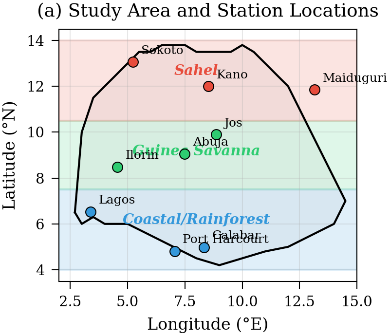
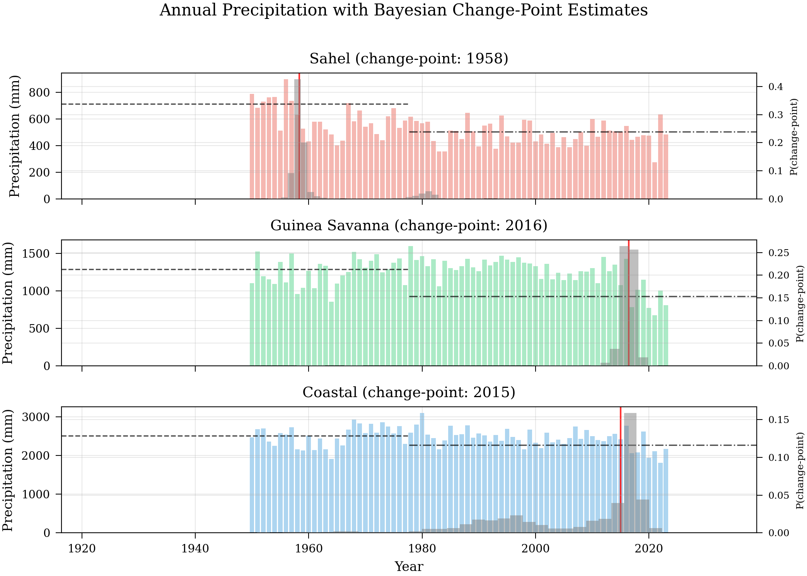
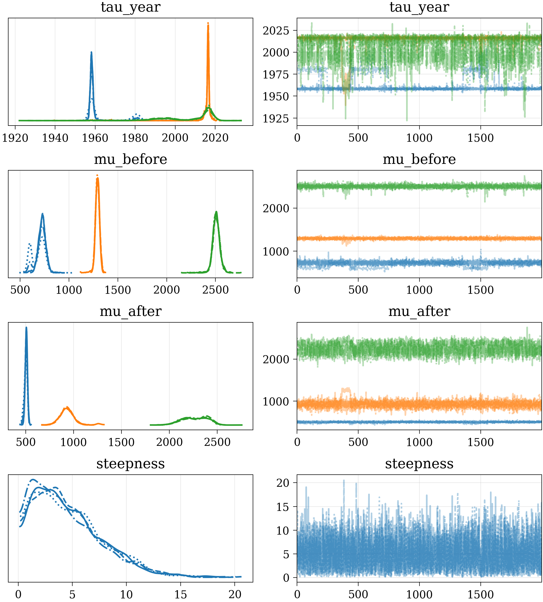
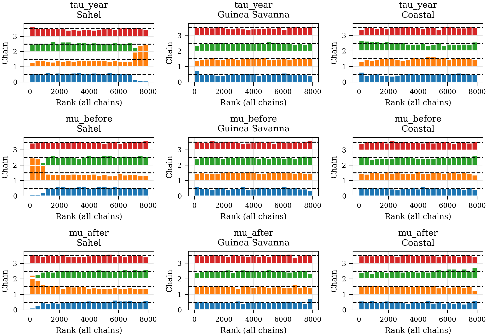
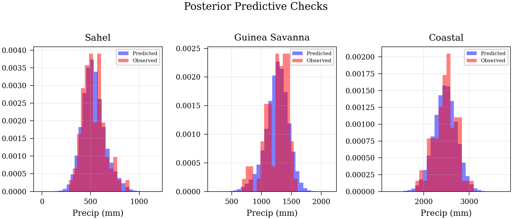
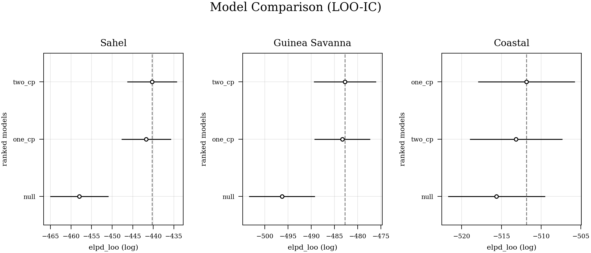
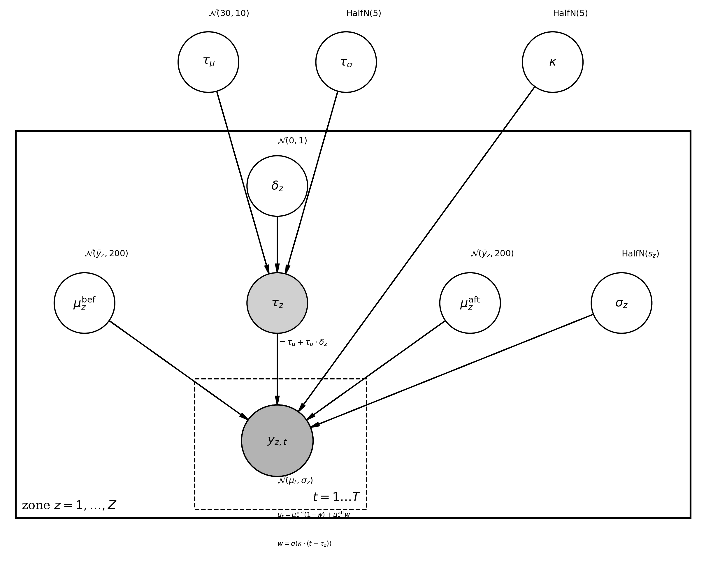

# Bayesian Change-Point Detection in Nigerian Rainfall Patterns

**A Hierarchical Analysis Across Climate Zones**

[](https://www.python.org/downloads/)
[](https://www.pymc.io/)
[](LICENSE)

This repository contains the full reproducible pipeline for a research paper applying **hierarchical Bayesian change-point detection** to 74 years (1950--2023) of precipitation data across Nigeria's three major climate zones. The project uses PyMC for probabilistic modeling and MCMC inference.

---

## Key Findings

| Zone | Change-Point (Year) | 94% HDI | Shift (mm/yr) |
|------|:-------------------:|:-------:|:-------------:|
| Sahel | 1958 | [1957, 1960] | -215 |
| Guinea Savanna | 2016 | [2014, 2017] | -366 |
| Coastal | 2015 | [1996, 2022] | -236 |
| **Group (hierarchical)** | **1989** | **[1974, 2003]** | -- |

- The **null model** (no change-point) is decisively rejected for all zones via LOO cross-validation.
- The **two change-point** model is marginally preferred for Sahel and Guinea Savanna; the **single change-point** model is preferred for Coastal.
- The hierarchical model reveals **coherent but asynchronous** climate transitions across zones.

---

## Study Area

Nine meteorological stations across three Nigerian climate zones:

- **Sahel** (semi-arid, north): Maiduguri, Kano, Sokoto
- **Guinea Savanna** (sub-humid, central): Abuja, Jos, Ilorin
- **Coastal/Rainforest** (humid tropical, south): Lagos, Port Harcourt, Calabar

Data source: [Open-Meteo Historical Weather API](https://open-meteo.com/) (ERA5 reanalysis, 0.25 deg resolution).

---

## Repository Structure

```
.
├── data/
│   ├── raw/                          # Cached Open-Meteo API JSON responses (9 cities x 8 decades)
│   ├── traces/                       # MCMC NetCDF trace files (14 files)
│   ├── rainfall_daily.csv            # Consolidated daily precipitation
│   ├── annual_city_rainfall.csv      # Annual totals per city
│   ├── annual_zone_rainfall.csv      # Annual zone-level means
│   └── monthly_zone_rainfall.csv     # Monthly zone-level means
├── figures/                          # Publication-quality PDF/PNG figures
├── notebooks/                        # Numbered analysis scripts (run sequentially)
│   ├── 01_data_acquisition.py        # Fetch data from Open-Meteo API
│   ├── 02_data_processing.py         # Clean, interpolate, aggregate
│   ├── 03_eda.py                     # Exploratory data analysis & plots
│   ├── 04_single_changepoint.py      # Per-zone single change-point model (PyMC)
│   ├── 05_hierarchical_model.py      # Hierarchical Bayesian model
│   ├── 06_model_comparison.py        # Null vs 1-CP vs 2-CP (LOO-IC, WAIC)
│   ├── 07_paper_figures.py           # Generate all publication figures
│   └── 08_model_diagram.py           # Kruschke-style PGM plate diagram
├── paper/
│   ├── main.tex                      # IEEEtran LaTeX source
│   └── references.bib                # BibTeX references (18 entries)
├── src/
│   └── utils.py                      # Shared utilities (zones, API, IEEE style)
├── colab_mcmc_combined.py            # Self-contained Colab MCMC script
├── create_word_paper.py              # Generate Word doc with embedded figures
├── requirements.txt                  # Python dependencies
├── LICENSE
└── README.md
```

---

## Methodology

### Models

1. **Single Change-Point Model** -- Piecewise-constant mean with a sigmoid soft-switch at unknown year tau, enabling gradient-based NUTS sampling.

2. **Hierarchical Change-Point Model** -- Partial pooling of change-point timing across zones via shared hyperpriors. Uses non-centered parameterization for efficient sampling.

3. **Model Comparison** -- Null (constant mean), single change-point, and two change-point models compared via LOO-CV (PSIS-LOO) and WAIC.

### Prior Choices

All priors follow a **weakly informative** strategy (Gelman et al., 2006):

| Parameter | Prior | Justification |
|-----------|-------|---------------|
| tau (single CP) | Normal(N/2, N/4) | Centered mid-record, ~18yr SD covers full range |
| tau_mu (hierarchical) | Normal(30, 10) | Encodes known Sahel drought ~1980; 10yr SD allows data to override |
| tau_sigma | HalfNormal(5) | Permits up to ~15yr cross-zone asynchrony |
| mu_1, mu_2 | Normal(y_bar, 2*s) | Data-scaled, covers plausible rainfall range |
| sigma | HalfNormal(s) | Scaled to observed variability, enforces positivity |
| kappa (hierarchical) | HalfNormal(5) | Learnable transition steepness |

### MCMC Configuration

- **Sampler**: NUTS (No-U-Turn Sampler)
- **Chains**: 4
- **Draws**: 2,000 (comparison models) / 4,000 (single & hierarchical)
- **Tuning**: 1,000--2,000 steps
- **Target accept**: 0.95
- **Convergence criteria**: R-hat < 1.01, ESS > 400

---

## Quickstart

### 1. Clone the repository

```bash
git clone https://github.com/batestguy/Bayesian-Change-Point-Detection-in-Nigerian-Rainfall-Patterns-A-Hierarchical-Analysis-Climate-Zones.git
cd Bayesian-Change-Point-Detection-in-Nigerian-Rainfall-Patterns-A-Hierarchical-Analysis-Climate-Zones
```

### 2. Set up the environment

```bash
conda create -n bap3 python=3.10
conda activate bap3
pip install -r requirements.txt
```

### 3. Run the pipeline

The scripts are numbered for sequential execution:

```bash
# Data acquisition (uses cached API responses if available)
python notebooks/01_data_acquisition.py

# Data processing and aggregation
python notebooks/02_data_processing.py

# Exploratory data analysis
python notebooks/03_eda.py

# MCMC models (5-15 min each)
python notebooks/04_single_changepoint.py
python notebooks/05_hierarchical_model.py
python notebooks/06_model_comparison.py

# Publication figures
python notebooks/07_paper_figures.py
python notebooks/08_model_diagram.py
```

> **Note**: MCMC scripts (04--06) are computationally intensive. Pre-computed traces are included in `data/traces/` so you can skip directly to figure generation (07, 08) if desired.

### 4. Compile the paper (optional)

```bash
cd paper
pdflatex main && bibtex main && pdflatex main && pdflatex main
```

### 5. Generate Word document (optional)

```bash
python create_word_paper.py
```

---

## Figures

The pipeline produces 7 publication-quality figures:

| Figure | Description | File |
|--------|-------------|------|
| Fig. 1 | Study area map with climate zones and stations | `fig1_study_area` |
| Fig. 2 | Annual rainfall with posterior change-point distributions | `fig2_changepoint_timeseries` |
| Fig. 3 | MCMC trace plots (convergence diagnostics) | `fig3_trace_plots` |
| Fig. 4 | Rank plots (chain mixing diagnostics) | `fig3b_rank_plots` |
| Fig. 5 | Posterior predictive checks | `fig5_ppc` |
| Fig. 6 | LOO model comparison | `fig6_model_comparison` |
| Fig. 7 | Kruschke-style PGM plate diagram | `fig_model_diagram` |

All figures are saved as both PDF (for LaTeX) and PNG (for Word/web).

### Figure gallery

The key results are shown below using the PNG figures already included in this
repository. GitHub renders these images directly from the `figures/` folder.

#### Study area and estimated rainfall change-points

<p align="center">
  
  
</p>

<p align="center"><em>Left: study area and station locations. Right: annual precipitation and posterior change-point distributions.</em></p>

#### Bayesian diagnostics and model validation

<p align="center">
  
  
</p>

<p align="center">
  
  
</p>

<p align="center"><em>Trace and rank plots assess MCMC quality; posterior predictive checks and LOO-IC compare model fit with the observed rainfall data.</em></p>

#### Hierarchical model structure

<p align="center">
  
</p>

<p align="center"><em>Probabilistic graphical model showing how zone-level change-points share information through the hierarchical structure.</em></p>

---

## Data

### Source

[Open-Meteo Historical Weather API](https://open-meteo.com/) -- free, no API key required. Provides ERA5 reanalysis data at 0.25 deg spatial resolution.

### Processed Datasets

| File | Description | Shape |
|------|-------------|-------|
| `rainfall_daily.csv` | Daily precipitation for 9 cities (1950--2023) | ~194,000 rows |
| `annual_city_rainfall.csv` | Annual totals per city | 666 rows |
| `annual_zone_rainfall.csv` | Zone-level annual means (3 cities averaged) | 222 rows |
| `monthly_zone_rainfall.csv` | Zone-level monthly means | 2,664 rows |

### MCMC Traces

Pre-computed NetCDF traces are included in `data/traces/` for reproducibility:

- `single_changepoint_{zone}.nc` -- Per-zone single change-point posteriors
- `hierarchical_changepoint.nc` -- Hierarchical model posteriors
- `comparison_{zone}_{model}.nc` -- Model comparison traces (null, one_cp, two_cp)

---

## Running on Google Colab

Local MCMC may be slow on some machines. A self-contained Colab script is provided:

```bash
# Upload colab_mcmc_combined.py to Google Colab and run
# It includes embedded data, all model fits, and result packaging
# Total runtime: ~27 min on Colab CPU
```

See `CLAUDE.md` for detailed Colab instructions and troubleshooting.

---

## Citation

If you use this code or methodology in your research, please cite:

```bibtex
@inproceedings{bayesian_changepoint_nigeria_2026,
  title     = {Bayesian Change-Point Detection in Nigerian Rainfall Patterns:
               A Hierarchical Analysis Across Climate Zones},
  year      = {2026},
  note      = {IEEE Conference Paper}
}
```

---

## License

This project is licensed under the MIT License -- see [LICENSE](LICENSE) for details.

---

## Acknowledgments

- [Open-Meteo](https://open-meteo.com/) for free access to ERA5 reanalysis data
- [PyMC](https://www.pymc.io/) and [ArviZ](https://arviz-devs.github.io/arviz/) development teams
- ERA5 reanalysis produced by ECMWF within the Copernicus Climate Change Service
